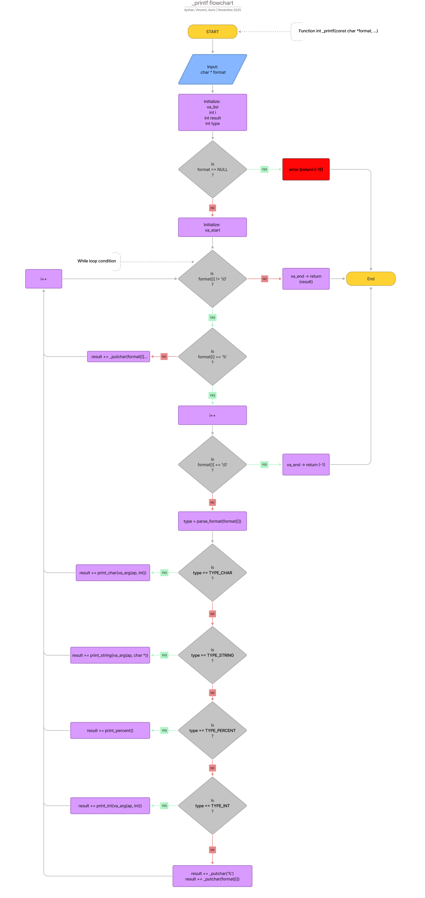

# PRINTF PROJECT
Creation of our own printf function by Auric CHEN, Vincent RENAUD, Aythan CRISTOVAO C#28-Sens

## Description
The _printf function behaves like the standard "printf" function in C language.
It supports several format specifiers such as "%c", "%s" and "%%" then %d" and "%i".

## Compilation
Use the GCC commande below to compile and run the project:

gcc -Wall -Werror -Wextra -pedantic -std=gnu89 -Wno-format *.c -o our_printf && ./our_printf

## Requirements
Edit the code on vi, vim or emacs.
Use git for version control.
Compiled on Ubuntu 20.04 LTS using gcc, using the options -Wall -Werror -Wextra -pedantic -std=gnu89.

## Usage exemples
_printf("Length:[%d, %i]\n", len, len);
-->STDOUT: Length:[39, 39]

_printf("Negative:[%d]\n", -762534);
-->STDOUT: Negative:[-762534]

_printf("Character:[%c]\n", 'H');
-->STDOUT: Character:[H]

_printf("String:[%s]\n", "I am a string !");
-->STDOUT: String:[I am a string !]

_printf("Percent:[%%]\n");
-->STDOUT: Percent:[%]

## Man page
To view the custom manual page:
man ./man_3_printf

## Testing
To validate the fonctionnality of our funtion, we used:
-Betty for style
-Valgrind to check memory leaks
-GCC for error:
	-Wall (enable most warning messages)
	-Werror (treat all warnings as errors)
	-Wextra (enables additional warnings that -Wall does not cover)
	-pedantic (enforces strict ISO C compliance)
	-std=gnu89 (specifies the C standard to use)
	-Wno-format (Disables warnings related to format strings, here printf)

## Flowchart
To see the flowchart, 

## Usefull informations
main.h containts all the prototypes and defines handles all cases.
parse_format.c checks each format specifier and return the correct type handler.
arg-func.c containts all functions handling specific argument types.
_printf scans the string, finds each "%" character, validates it, and calls the corresponding function to process the argument and print the output.
